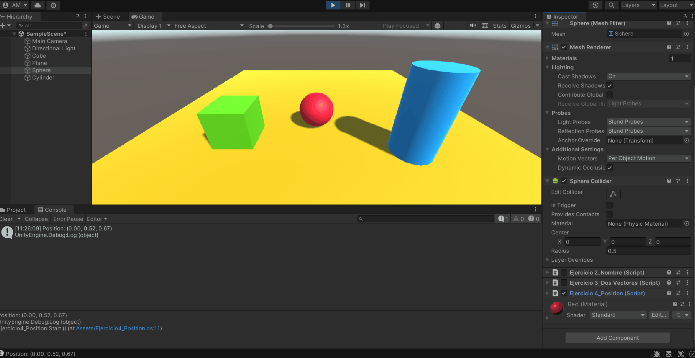

# ii-practica2-introduccion-c-sharp
**Autor**: Adriano dos Santos Moreira

## Ejercicio 1
Creé un array y lo inicialicé en Start con números aleatorios. En Update se selecciona un elemento aleatoriamente y se recalcula el valor aleatoriamente.
El rango de generación de los números es una variable pública.

## Ejercicio 2
Cada objeto usa el mismo script, que dice el nombre del propio objeto.

## Ejercicio 3
Creé dos vectores públicos e hice uso de las funciones de *Vector3* para calcular:
- Las magnitudes.
- El ángulo entre ellos.
- La distancia entre ellos.
- El de mayor altura.

## Ejercicio 4
Se muestra la posición del objeto haciendo uso de su *transform*.

## Ejercicio 5
Accedemos a las posiciones del cilindro y el cubo para calcular la distancia entre ellos.

## Ejercicio 6
A partir de los transform del cilindro y el cubo, actualizamos su posición en cada frame alterando únicamente la componente *x*, que será la misma que la de la esfera (quien ejecuta el script) solo que desplazada 5 unidades.

## Ejercicio 7
Empezamos recogiendo los *Material* del cilindro y el cubo. En cada *Update* cambiamos el color de los objetos cuando se detecta la pulsación de las teclas "A" y "UpArrow".

## Ejercicio 8
Separamos 5 esferas nuevas y una que ya habíamos colocado en dos grupos, uno con la tag "Group1" y otro con "Group2". En un script recogemos las esferas del segundo grupo y lo recorremos para encontrar el más lejano y el más cercano al cubo.   
Movemos el más cercano 2 unidades hacia arriba y hacemos que el más lejano cambie de color cuando pulsamos la barra espaciadora.

